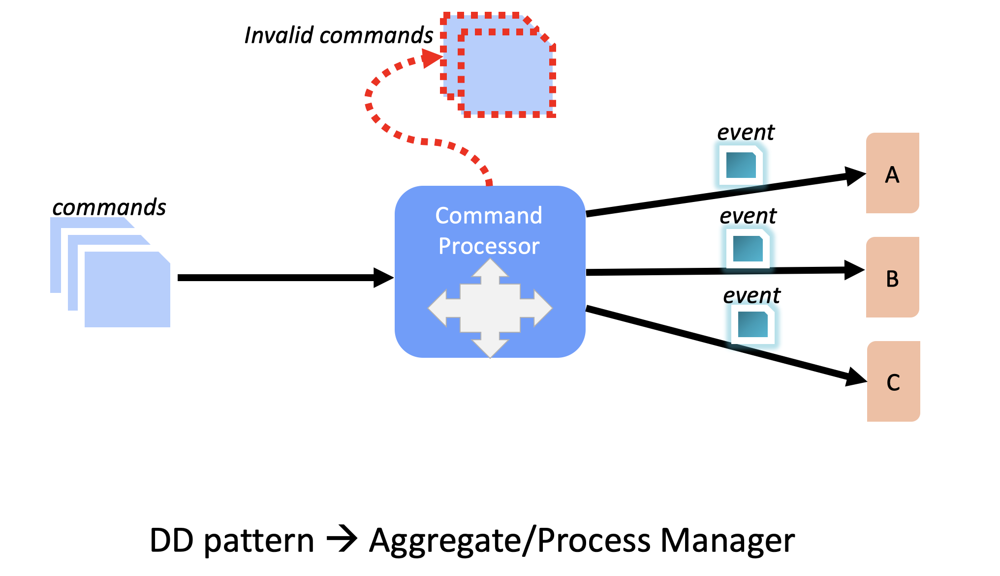
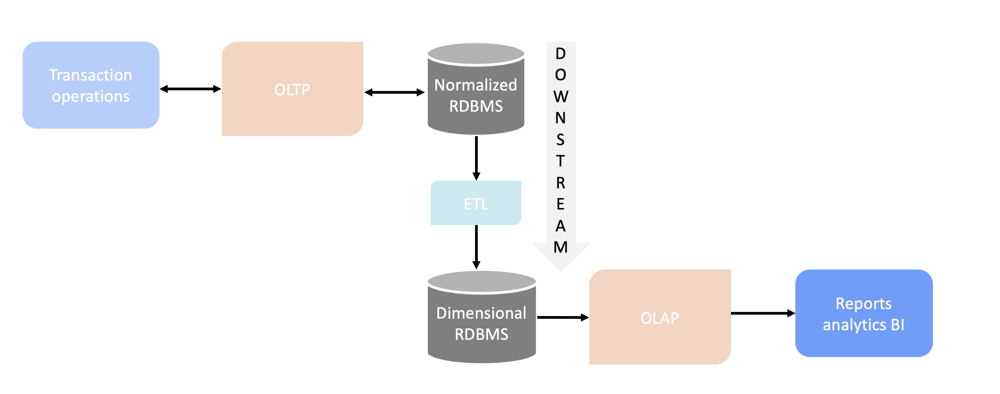
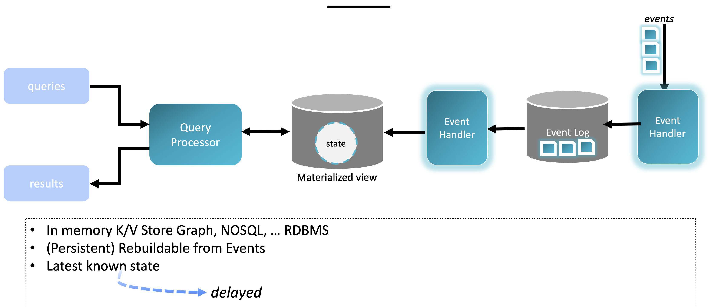
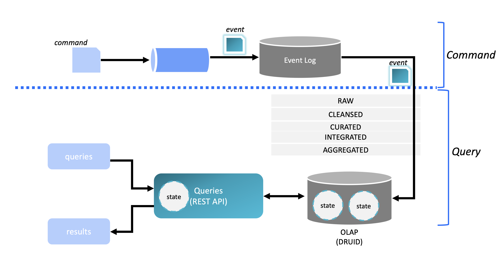

# CQRS Using CDC

CQRS & Event Sourcing are "THE BUZZ" words these days and how it fits in real time analytics.

But what is CQRS?. Well in a simple definition - "CQRS is software building pattern that works on separating the part of the application that changes the state of an application & part that queries state of an application"

What is an Event Souring -  “All changes to an application state are stored as a sequence of events.”  Martin Fowler
- Change made to state are tracked as events
- Event are stored in event store (any database)
- Use stored events and summation of all these events (always arrive in current state)

**NOTE**  Event Sourcing is not part of CQRS 

The Change Data Capture (CDC) provides an easy mechanism to implement these. Further CDC, in the world of micro-services, data services & real time analytics is a central part of a modern architecture these days.Check   out my GitHub project which demonstrates: 
1. CQRS 
2. Event Sourcing
3. CDC using Debezium (good bye to expensive CDC products & complicated integration)
4. Kafka Connect
5. Kafka 
6. Real time streaming
7. Spring Cloud Stream

## CQRS Bank Application - Using CQRS + Event Soiurcing with Events relay using CDC
A bank application which demonstrates CQRS design pattern. This application performs following operations:

1. Money withdrawal using debit card

2. List all the money withdrawal (mini bank statement)

This application uses following two tables for above operations:

1. _**debit_card**_

2. _**money_withdrawal**_

A debit card withdrawl operation is stored in debit_card table. Once the transaciton is successfully committed in the debit_card table, using Debezium's & Kafka connect the CDC is moved to Kafka. Once the message arrive in Kafka topic, using Spring Cloud Stream Stream Listener, an entry in made to money_withdrawl table. This table is used to create mini statement (query)

**_NOTE_** For sake of simplicity same DB is used but as can be seen - "a command to perform debit operation" is separated from mini statement.

Following picture shows architecture of this application:

## Pre-requisite

1. _MySQL_

2. _Apache Kafka_

3. _Kafka Connect_

4. _Debezium_

5. _Spring Cloud Stream_

6. _Zookeeper_

7. _Docker_

**_NOTE_**: This application is completely dockerized.

## Run Application

1. Run bank application complete infrastructure:

    docker-compose up

2. Instruct Kafka Connect to tail transaction log of MySQL DB  and start sending messages as CDC to Kafka:

    curl -i -X POST -H "Accept:application/json" -H  "Content-Type:application/json" http://localhost:8083/connectors/ -d @mysqlsource.json --verbose

3. Money withdrawal operation:

    curl http://localhost:8080/moneywithdrawals -X POST --header 'Content-Type: application/json' -d '{"debitCard":"123456789", "amount": 10.00}' --verbose

4. Mini statement fetching operation (query/read model)

    curl http://localhost:8080/moneywithdrawals?debitCardId=123456789 --verbose
    
  
 ## CQRS,Event Sourcing & Its Usage In Analytics Demystified
 _Before going in app, below are the key concepts:_
 
 **Command Vs Event**
 
 _Command – “submit order”_
 
 - A request (imperative statement)
 - May fail
 - May affect multiple aggregates
 
 **NOTE**: _~~Rebuild Aggregate State from Commands~~_
 
 _Event – “order submitted”_
 
 - Statement of fact (past tense)
 - Never fails
 - May affect a single aggregate
 
 **NOTE:** _Rebuild Aggregate State from Events_
 
 
 **Command to Event**
 
 Following digram explain creation of _**Event** from a **Command**_
 
 
 
 
 
 Once a **Command** is converted to an **Event**, _**the state**_ can be reterived as shown below:
 
 
 
 
 **Classical BI**
 
 A classical BI is shown below: **_NOT A NEW IDEA_**
 
 
 
 
 **Tying knots together - CQRS & Event Sourcing**
 
 Below shows **_CQRS_** & **_Event Sourcing_**: 
 
 
 
 But "?" is still missing block. This missing "?" is called **_"State" or "Materialized View"_**
 
 
 
 - Query a RDMS?  Old style
     - RDMS is option (will become bottleneck as volume of data increases)
 - Views are optimized for specific query use cases
     - multiple view of same events
 - Update is asynchronously  delayed  eventual consistency  build to scale
 - Easy to evolve or fix
     - Change or fix logic; rebuild view from events  event log is the source of truth not the view
 - Views can be rebuilt from the events 
 
 Indexing is key concerns when "Command" is separated from "Query". Following diagram shows architecture to achieve this:
 
 
 
 **Snapshotting**
 Snapshotting is one of the key concepts in "Event Sourcing". Following diagram shows this:
 
 
 
 **Event sourcing/cqrs drawback**
 
 - No  “One-Size-Fits-All”
     - Multiple “topic’ implementation
 - Delayed reads
 - No ACID transactions
 - Additional complexity
 
 **Event sourcing/cqrs benefits**
 
 - No  “One-Size-Fits-All”
     - “topic’ are optimized for usecases
 - Eventual consistency
 - History, temporal queries
 - Robust for data corruption
 
 
 **The Complete Picture**
 
 The below picture shows the end to end architecture using CQRS & Event Sourcing
 
 