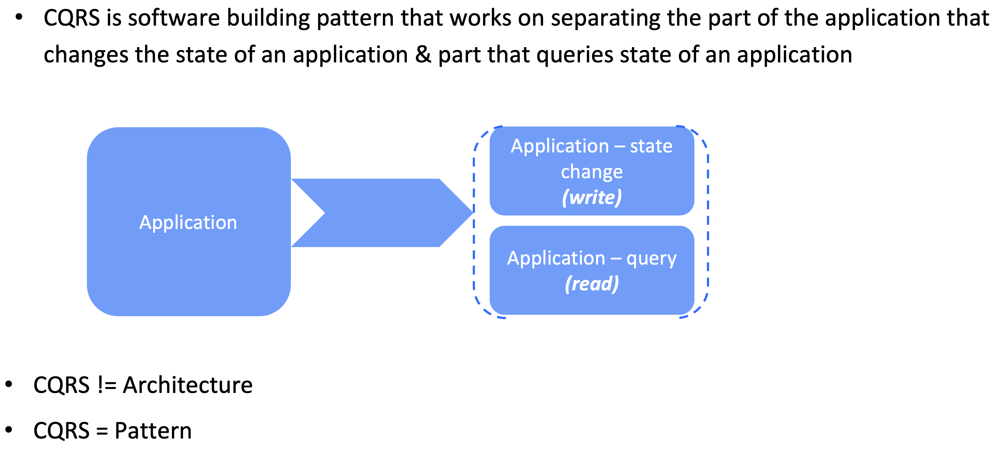
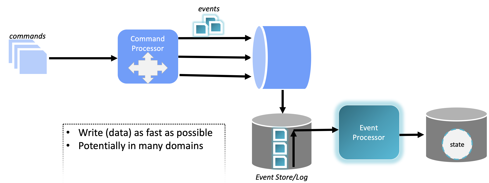
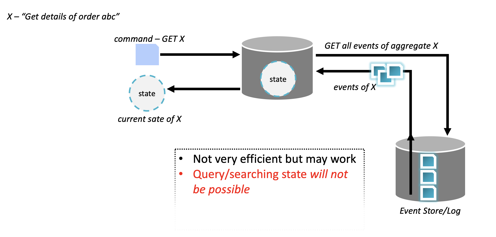
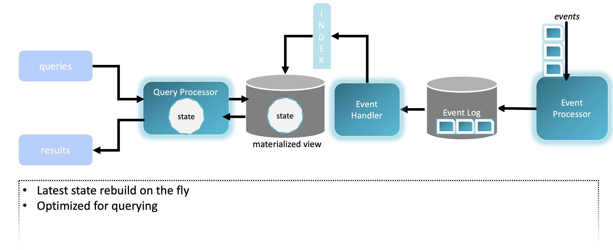
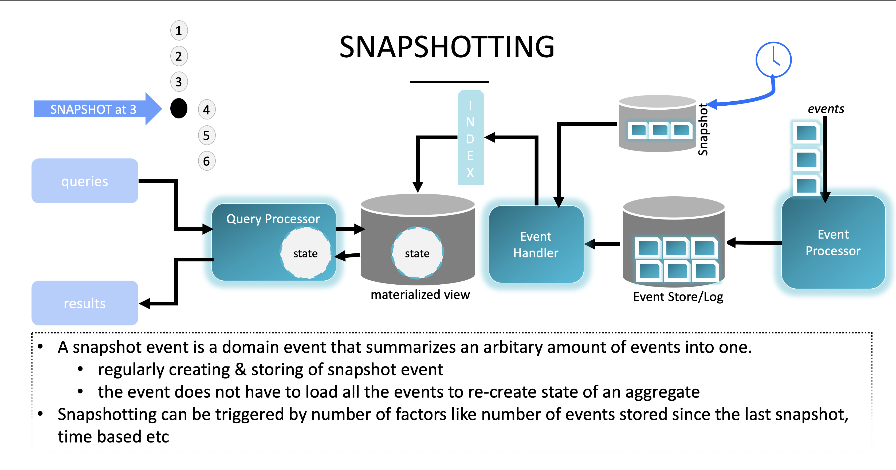

# CQRS + Event Sourcing Using CDC + OLAP Using Druid

CQRS & Event Sourcing are "THE BUZZ" words these days and how it fits in real time analytics. Microservices architecture causes segregation of applications (also called mushrooming of application landscape). This posses challenge for the Data Engineering teams. The proposed architecture (in the GitHub blog) demystifies CQRS + Event Sourcing in Real time analytics and hence bridges the gap between Full Stack Developers & Data Engineer. 



**NOTE: CQRS + Event Sourcing = Elegant DDD**

Event Souring -  “All changes to an application state are stored as a sequence of events.”  Martin Fowler
- Change made to state are tracked as events
- Event are stored in event store (any database)
- Use stored events and summation of all these events (always arrive in current state)

**NOTE**  Event Sourcing is not part of CQRS 


The Change Data Capture (CDC) provides an easy mechanism to implement these. Further CDC, in the world of micro-services, data services & real time analytics is a central part of a modern architecture these days.Check   out my GitHub project which demonstrates: 
1. CQRS 
2. Event Sourcing
3. CDC using Debezium (good bye to expensive CDC products & complicated integration)
4. Kafka Connect
5. Kafka 
6. Real time streaming
7. Spring Cloud Stream


## CQRS Bank Application - Using CQRS + Event Sourcing with Events relay using CDC
A bank application which demonstrates CQRS design pattern. This application performs following operations:

1. _Money withdrawal using debit card_

2. _List all the money withdrawal (mini bank statement)_

This application uses following two tables for above operations:

1. _**debit_card**_

2. _**money_withdrawal**_

A debit card withdrawl operation is stored in debit_card table. Once the transaciton is successfully committed in the debit_card table, using Debezium's & Kafka connect the CDC is moved to Kafka. Once the message arrive in Kafka topic, using Spring Cloud Stream Stream Listener, an entry in made to money_withdrawl table. This table is used to create mini statement (query)

**_NOTE_** For sake of simplicity same DB is used but as can be seen - "a command to perform debit operation" is separated from mini statement.


Following picture shows architecture of this application:


To demonstrate OLAP capabilities, this application write mini statement to Kafka topic - "ministatement". From this topic, Druid picks it up and provide fast querying abilities


## Pre-requisite

1. _MySQL_

2. _Apache Kafka_

3. _Kafka Connect_

4. _Debezium_

5. _Spring Cloud Stream_

6. _Zookeeper_

7. Druid

8. _Docker_

**_NOTE_**: This application is completely dockerized.

## Run Application

**The complete reference architecture implementation is dockerized. Hence it takes just few minutes to run this application locally or any cloud provider of your choice.**

Execute following steps to run the application:

- _Build bank app_
    
```bash
    mvn clean install -DskipTests
```

- _Run bank application complete infrastructure:_
    
```bash
    docker-compose up
```

- _Instruct Kafka Connect to tail transaction log of MySQL DB  and start sending messages as CDC to Kafka:_

```bash    
    curl -i -X POST -H "Accept:application/json" -H  "Content-Type:application/json" http://localhost:8083/connectors/ -d @mysqlsource.json --verbose
```

- _Instruct Druid connect with Kafka_

```bash
curl -XPOST -H'Content-Type: application/json' -d @bank-app-mini-statement-supervisor.json http://localhost:8081/druid/indexer/v1/supervisor
```

- _Money withdrawal operation:_

```bash    
    curl http://localhost:8080/moneywithdrawals -X POST --header 'Content-Type: application/json' -d '{"debitCard":"123456789", "amount": 10.00}' --verbose
```

- _Mini statement fetching operation (query/read model)_

```bash   
    curl http://localhost:8080/moneywithdrawals?debitCardId=123456789 --verbose
```    
  
 # CQRS,Event Sourcing & Its Usage In Analytics Demystified
 _In section some of key concepts of CQRS & Event Sourcing are explained along with it's usage in analytics_
 
 **Command Vs Event**
 
 _Command – “submit order”_
 
 - A request (imperative statement)
 - May fail
 - May affect multiple aggregates
 
 **NOTE**: _~~Rebuild Aggregate State from Commands~~_
 
 _Event – “order submitted”_
 
 - Statement of fact (past tense)
 - Never fails
 - May affect a single aggregate
 
 **NOTE:** _Rebuild Aggregate State from Events_
 
 
 **Command to Event**
 
 Following digram explain creation of _**Event** from a **Command**_
 
 
 
 
 
 Once a **Command** is converted to an **Event**, _**the state**_ can be reterived as shown below:
 
 
 
 
 **Classical BI**
 
 A classical BI is shown below: **_NOT A NEW IDEA_**
 
 
 
 
 **Tying knots together - CQRS & Event Sourcing**
 
 Below shows **_CQRS_** & **_Event Sourcing_**: 
 
 
 
 But "?" is still missing block. This missing "?" is called **_"State" or "Materialized View"_**
 
 
 
 - Query a RDMS?  Old style
     - RDMS is option (will become bottleneck as volume of data increases)
 - Views are optimized for specific query use cases
     - multiple view of same events
 - Update is asynchronously  delayed  eventual consistency  build to scale
 - Easy to evolve or fix
     - Change or fix logic; rebuild view from events  event log is the source of truth not the view
 - Views can be rebuilt from the events 
 
 Indexing is key concerns when "Command" is separated from "Query". Following diagram shows architecture to achieve this:
 
 
 
 **Snapshotting**
 Snapshotting is one of the key concepts in "Event Sourcing". Following diagram shows this:
 
 
 
 **Event sourcing/cqrs drawback**
 
 - No  “One-Size-Fits-All”
     - Multiple “topic’ implementation
 - Delayed reads
 - No ACID transactions
 - Additional complexity
 
 **Event sourcing/cqrs benefits**
 
 - No  “One-Size-Fits-All”
     - “topic’ are optimized for usecases
 - Eventual consistency
 - History, temporal queries
 - Robust for data corruption
 
 
 **The Complete Picture**
 
 The below picture shows the end to end architecture using CQRS & Event Sourcing
 
 
